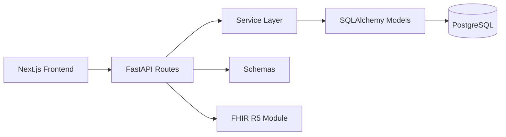

# Scheduler Optimizer

Internal scheduling, handover, and staffing operations platform for nursing teams.

## What This Repo Contains

- `backend/`: FastAPI API, business logic, SQLAlchemy models, and Alembic migrations
- `frontend/`: Next.js App Router UI, auth-aware client flows, and feature pages
- `docs/`: operational guides and feature notes
- `start_backend.sh`: helper script to start the API on `127.0.0.1:8000`

## Quick Start

### Backend

```bash
cd backend
python -m venv ../.venv
source ../.venv/bin/activate
pip install -r requirements.txt
alembic upgrade head
uvicorn app.main:app --host 127.0.0.1 --port 8000
```

### Frontend

```bash
cd frontend
npm install
npm run dev
```

Frontend runs on `http://127.0.0.1:3000` and calls the backend at `http://127.0.0.1:8000`.

## Admin Quick Start

This project is primarily a unit scheduling and staffing system. The most important internal concepts to understand are:

- Shift codes define the actual schedule assignments used in the unit.
- Staffing roles separate basic staff access from leadership coverage responsibilities.
- Staffing teams group nurses for operational coverage and weekend rotation logic.
- Full coverage means the schedule meets minimum safe staffing requirements by day and time block, not just a raw total count.
- The scheduler prioritizes preserving valid existing assignments, honoring leave, and then filling coverage gaps while balancing hours and constraints.

For the longer internal reference, see `docs/scheduler-operations-guide.md`.

## Environment

Frontend:

- `NEXT_PUBLIC_API_BASE_URL`
- Clerk public keys/settings

Backend:

- `DATABASE_URL`
- Clerk/server auth settings
- Other service keys used by optional integrations

## Architecture Overview



### Backend Architecture

- Entry point: `backend/app/main.py`
- HTTP routes: `backend/app/api/routes/`
- Domain models: `backend/app/models/`
- Request/response schemas: `backend/app/schemas/`
- Service/domain logic: `backend/app/services/`
- Shared utilities: `backend/app/utils/`
- DB wiring and dependencies: `backend/app/db/`
- Config and auth helpers: `backend/app/core/`
- Interop module (FHIR): `backend/app/fhir/`
- Database migrations: `backend/alembic/versions/`

### Frontend Architecture

- App shell and global layout: `frontend/src/app/layout.tsx`, `frontend/src/app/globals.css`
- Route pages: `frontend/src/app/*/page.tsx`
- Shared UI components: `frontend/src/app/components/`
- Feature-level scheduler UI: `frontend/src/app/scheduler/components/`, `frontend/src/app/scheduler/hooks/`, `frontend/src/app/scheduler/steps/`
- API client layer: `frontend/src/app/lib/api.ts`
- Runtime API base resolution: `frontend/src/app/lib/runtimeApiBase.ts`
- Organization context: `frontend/src/app/context/OrganizationContext.tsx`
- i18n messages: `frontend/src/i18n/messages/`

## Feature And Tool Map

### Core Scheduling

- Frontend: `frontend/src/app/scheduler/page.tsx`, `frontend/src/app/schedules/page.tsx`
- Backend routes: `backend/app/api/routes/schedule.py`, `backend/app/api/routes/optimized_schedule.py`, `backend/app/api/routes/scheduling.py`, `backend/app/api/routes/schedule_rules.py`
- Backend logic: `backend/app/services/self_scheduling.py`, `backend/app/utils/simple_scheduler.py`, `backend/app/utils/schedule_validation.py`

### Handover

- Frontend: `frontend/src/app/handover/page.tsx`, `frontend/src/app/handover/components/`
- Backend routes: `backend/app/api/routes/handover.py`
- Data model/schema: `backend/app/models/handover.py`, `backend/app/schemas/handover.py`

### Nurses, Patients, And Org Management

- Frontend: `frontend/src/app/nurses/page.tsx`, `frontend/src/app/patients/page.tsx`, `frontend/src/app/settings/page.tsx`
- Backend routes: `backend/app/api/routes/nurse.py`, `backend/app/api/routes/patient.py`, `backend/app/api/routes/organization.py`, `backend/app/api/routes/user.py`, `backend/app/api/routes/shift_codes.py`

### Analytics, Burnout, Ambient, Learning

- Frontend: `frontend/src/app/activities/page.tsx`, `frontend/src/app/burnout/page.tsx`, `frontend/src/app/ambient/page.tsx`, `frontend/src/app/learning/page.tsx`
- Backend routes: `backend/app/api/routes/analytics.py`, `backend/app/api/routes/burnout.py`, `backend/app/api/routes/ambient.py`, `backend/app/api/routes/learning.py`
- Backend services: `backend/app/services/analytics_service.py`, `backend/app/services/burnout_service.py`

### Announcements And Notifications

- Frontend: `frontend/src/app/announcements/page.tsx`
- Backend routes: `backend/app/api/routes/announcement.py`, `backend/app/api/routes/notification.py`
- Data model/schema: `backend/app/models/announcement.py`, `backend/app/models/notification.py`, `backend/app/schemas/announcement.py`, `backend/app/schemas/notification.py`

### Deletion Activity And Reconciliation

- Frontend: `frontend/src/app/activities/page.tsx`
- Backend routes: `backend/app/api/routes/deletion_activity.py`
- Backend logic: `backend/app/services/deletion_activity.py`, `backend/app/services/reconciliation_service.py`

### FHIR Interoperability

- Backend routes: `backend/app/api/routes/fhir.py`
- FHIR converters/resources: `backend/app/fhir/converters.py`, `backend/app/fhir/resources.py`

### Webhooks And System Prompts

- Backend routes: `backend/app/api/routes/webhook.py`, `backend/app/api/routes/system_prompts.py`
- Frontend support UI: `frontend/src/app/components/SystemPrompt.tsx`

## Notes On CSV Fixtures

- Canonical location for reusable CSV fixtures: `data/schedules/`
- Scheduler import implementation: `frontend/src/app/scheduler/hooks/usePreferenceImport.ts`
- Temporary schedule generation script: `backend/tmp_generate_balanced_minimal.py`

## Docs

- `docs/database-connection.md`
- `docs/testing-api-endpoints.md`
- `docs/bugfix-handover-refresh.md`
- `docs/translation-merge-notes.md`
- `docs/scheduler-operations-guide.md` — internal staffing and scheduling concepts, shift codes, role hierarchy, staffing teams, coverage logic, and feature usage guidance without sensitive data

## Testing

Backend tests are split between focused scripts and pytest tests.

- Root-level one-off test scripts: `test_vacation_fix.py`
- Backend test scripts: `backend/test_*.py`
- Backend pytest suite: `backend/tests/`

Example:

```bash
cd backend
pytest -q
```
